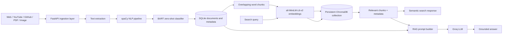
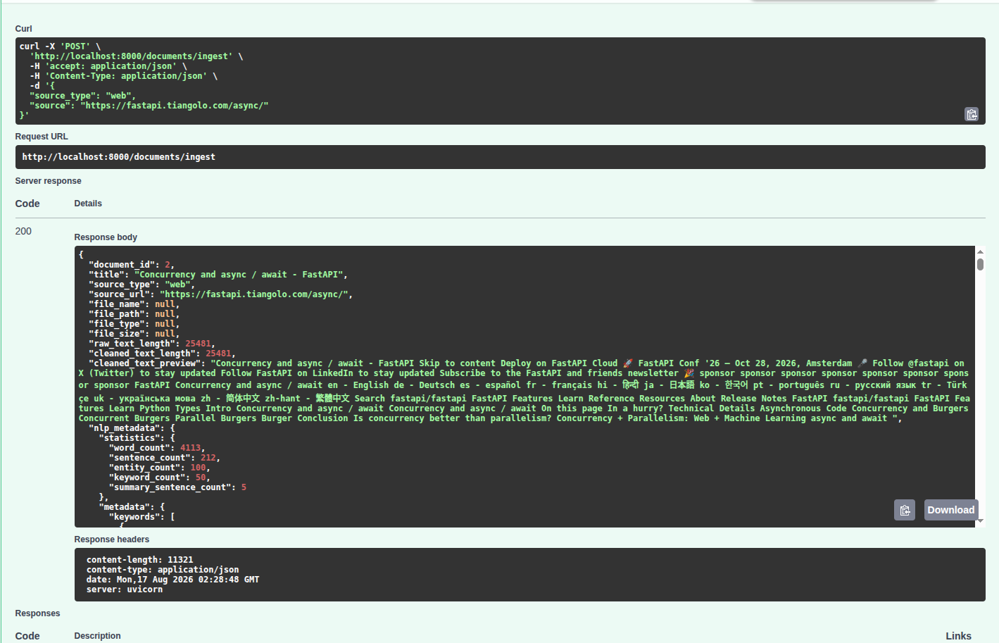
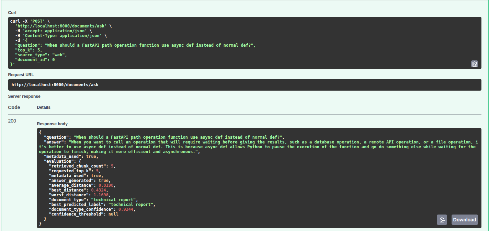

# ARIOS — AI Research Intelligence OS

FastAPI-based document intelligence and retrieval-augmented generation (RAG) backend for ingesting, analysing, indexing, searching, and questioning document collections.

> **Project status:** ARIOS is an active local-development project. The core ingestion, NLP, semantic search, and RAG paths are implemented; authentication, deployment, and production hardening are not.

## Project overview

ARIOS turns unstructured content into searchable document knowledge. It accepts web pages, YouTube transcripts, GitHub repositories, PDFs, and images, extracts their text, and stores document records in SQLite. An NLP pipeline adds statistics, named entities, keywords, an extractive summary, and a zero-shot document classification.

For retrieval, ARIOS divides cleaned text into overlapping word-based chunks, generates embeddings with `all-MiniLM-L6-v2`, and persists the vectors and source metadata in ChromaDB. Users can then run filtered semantic searches or ask questions through a Groq-hosted LLM using retrieved document context.

## Key features

### Implemented

- Multi-source ingestion for websites, YouTube transcripts, GitHub repositories, local PDF files, and OCR over images
- PDF and image upload endpoints with generated server-side filenames
- SQLite persistence for documents, extracted text, NLP metadata, and chunks
- spaCy-based tokenization, lemmatization-driven keyword extraction, named entity recognition, and document statistics
- Frequency-based extractive summarization
- Manual zero-shot classification with `facebook/bart-large-mnli`
- Automatic chunking, embedding, and ChromaDB indexing after URL-based ingestion
- Semantic similarity search with optional `source_type` and `document_id` filters
- RAG question answering through Groq, with retrieved chunks and NLP metadata used as context
- DVC stages for offline preprocessing, chunking, and embedding generation
- Standalone TF-IDF, cosine-similarity, and NMF topic-modelling utilities

### Planned

- Authentication and user-specific document collections
- Retrieval evaluation and reranking
- Structured citations in generated answers
- Streaming responses and cloud deployment
- Broader automated test coverage

## System architecture



## End-to-end workflow

1. A client submits a URL/repository through `POST /documents/ingest`, or uploads a PDF/image through `POST /documents/upload`.
2. The matching ingestion adapter extracts text into a common schema.
3. The NLP service cleans and normalizes the text, creates a spaCy document, and extracts statistics, entities, keywords, and a summary.
4. BART-MNLI scores the text against eight candidate document labels.
5. ARIOS stores the document, text, and NLP metadata in SQLite.
6. URL-based ingestion automatically creates overlapping chunks, embeds them, and adds them to ChromaDB. Uploaded files currently require the separate chunk and vector-store endpoints.
7. Semantic search embeds a query and retrieves the closest chunks, optionally constrained by source type or document ID.
8. The `/documents/ask` route combines retrieved chunks with stored analysis metadata and sends a context-restricted prompt to Groq.

## Technology stack

| Area | Technologies | Role |
|---|---|---|
| API | Python, FastAPI, Pydantic, Uvicorn | HTTP routes, validation, and interactive API documentation |
| Persistence | SQLAlchemy, SQLite | Documents, chunks, and NLP metadata |
| Traditional NLP | spaCy, scikit-learn | Text processing, NER, keywords, summaries, TF-IDF, similarity, and NMF topics |
| Transformers | Hugging Face Transformers, PyTorch, `facebook/bart-large-mnli` | Zero-shot document classification |
| Embeddings | Sentence Transformers, `all-MiniLM-L6-v2` | Document and query embeddings |
| Vector search | ChromaDB `PersistentClient` | Persistent similarity search and metadata filtering |
| Generation | Groq Python SDK | Context-grounded answer generation |
| Ingestion | Requests, Beautiful Soup, PyMuPDF, EasyOCR, YouTube Transcript API, GitPython | Source-specific text extraction |
| Data pipeline | DVC | Reproducible offline preprocessing, chunking, and embedding stages |

## NLP pipeline

The active ingestion pipeline performs whitespace cleanup, Unicode normalization, tokenization, named entity recognition, keyword extraction, extractive summarization, and document-level statistics. Keywords are selected from non-stop-word nouns, proper nouns, and adjectives, grouped by lemma and frequency. Summary sentences are ranked using normalized frequencies of informative tokens while preserving their original document order.

The stored analysis includes word, sentence, entity, keyword, and summary counts; up to 100 entities; up to 50 keywords; a five-sentence extractive summary; and transformer classification results.

The repository also contains reusable stop-word removal, lemmatization, POS tagging, dependency parsing, single/corpus TF-IDF, cosine similarity, and TF-IDF + NMF topic-modelling modules. These utilities are implemented in code but are not currently exposed through active FastAPI endpoints or called by the main ingestion pipeline.

## Transformer-based document classification

ARIOS manually implements the core zero-shot classification process using `facebook/bart-large-mnli`. For each label, it pairs up to the first 3,000 characters of a document with a hypothesis, runs natural-language inference, and uses the entailment probability as the score.

Candidate labels are:

- research paper
- tutorial
- documentation
- blog article
- news article
- resume
- technical report
- general article

The response stores all label scores and the best predicted label. A best score below `0.50` is reported as `uncertain`.

## Embeddings and vector search

Documents are split into 500-word chunks with a 50-word overlap by default. ARIOS embeds each chunk using `all-MiniLM-L6-v2` and stores it in the persistent ChromaDB `document_chunks` collection.

Each vector record includes:

- `document_id`
- `chunk_id`
- `chunk_index`
- `title`
- `source_type`
- `source_url`
- `file_path`

At search time, the same model embeds the query. ChromaDB returns the nearest chunks and their distances, with optional filtering by `source_type`, `document_id`, or both.

## RAG question-answering flow

`POST /documents/ask` implements the RAG path:

1. Embed the user's question.
2. Retrieve relevant chunks from ChromaDB.
3. Load the corresponding documents and selected NLP/classification metadata from SQLite.
4. Build a prompt that instructs the model to answer only from the supplied context and acknowledge missing information.
5. Generate an answer using the configured Groq model.

The current route returns the generated answer as a JSON string. Although retrieved metadata is used internally, structured source citations are not yet included in the response.

## API endpoints

| Method | Endpoint | Purpose |
|---|---|---|
| `GET` | `/` | Basic application status message |
| `GET` | `/health/db` | Verifies that a database session can be created |
| `POST` | `/documents/ingest` | Ingests, analyses, saves, chunks, embeds, and indexes a source |
| `POST` | `/documents/upload` | Uploads and analyses a PDF or image; does not auto-index it |
| `GET` | `/documents` | Lists stored documents |
| `GET` | `/documents/search` | Filters documents by title, source type, keyword, or entity |
| `GET` | `/documents/semantic-search` | Retrieves similar chunks with optional metadata filters |
| `GET` | `/documents/{document_id}` | Returns one stored document and its analysis |
| `POST` | `/documents/{document_id}/chunks` | Recreates chunks with configurable size and overlap |
| `GET` | `/documents/{document_id}/chunks` | Lists a document's stored chunks |
| `POST` | `/documents/{document_id}/embeddings` | Generates embedding metadata and previews without persisting vectors |
| `POST` | `/documents/{document_id}/vector-store` | Embeds existing chunks and stores them in ChromaDB |
| `GET` | `/documents/vector-store/count` | Returns the ChromaDB collection count; see current limitations |
| `POST` | `/documents/ask` | Retrieves context and generates a grounded answer |

FastAPI also generates interactive documentation at `/docs` and the OpenAPI schema at `/openapi.json` while the server is running.

## Project structure

```text
ARIOS/
├── back-end/
│   ├── core/                 # Configuration, database, and shared paths
│   ├── ingestion/            # Web, PDF, YouTube, image OCR, and GitHub adapters
│   ├── models/               # SQLAlchemy document and chunk models
│   ├── nlp/                  # NLP, ranking, similarity, and topic modules
│   ├── repositories/         # Database access for documents and chunks
│   ├── routes/               # Health and document API routes
│   ├── schemas/              # Pydantic request and ingestion schemas
│   ├── scripts/              # DVC preprocessing, chunking, and embedding stages
│   ├── services/             # Application, NLP, embedding, vector, RAG, and LLM logic
│   ├── utils/                # Uploaded-file storage
│   ├── main.py               # FastAPI application entry point
│   └── requirements.txt      # Partial dependency list; see setup notes
├── artifacts/                # DVC-tracked/generated artifacts
├── front-end/                # Reserved directory; no client implementation yet
├── dvc.yaml                  # Offline pipeline definition
└── dvc.lock                  # Locked DVC pipeline state
```

## Installation and setup

Python 3.10 or newer is recommended because the code uses modern union type syntax.

```bash
git clone https://github.com/rvarun03/ARIOS.git
cd ARIOS

python -m venv .venv
source .venv/bin/activate

pip install -r back-end/requirements.txt
pip install fastapi uvicorn sqlalchemy pydantic pydantic-settings python-dotenv python-multipart groq chromadb spacy scikit-learn torch transformers dvc
python -m spacy download en_core_web_sm
```

The second install command is currently necessary because `back-end/requirements.txt` lists the ingestion and embedding packages but does not yet declare every runtime dependency imported by the application.

On first startup, Hugging Face, Sentence Transformers, and EasyOCR may download model files. OCR and transformer inference can require substantial memory and startup time.

## Environment variables

Create `back-end/.env` and replace all placeholder values:

```dotenv
APP_NAME=ARIOS
ENV=dev
DATABASE_URL=sqlite:///./arios.db
GROQ_API_KEY=<your-groq-api-key>
GROQ_MODEL=<your-supported-groq-model-name>
```

`GROQ_API_KEY` must be present because the LLM service is initialized when the document service is imported. Keep `.env` out of version control.

## Run the FastAPI server

Run the application from `back-end` so its local imports and relative storage paths resolve consistently:

```bash
cd back-end
uvicorn main:app --host 127.0.0.1 --port 8000 --reload
```

Open `http://127.0.0.1:8000/docs` to explore and call the API.

## Example usage

Ingest and automatically index a web page:

```bash
curl -X POST "http://127.0.0.1:8000/documents/ingest" \
  -H "Content-Type: application/json" \
  -d '{
    "source_type": "web",
    "source": "https://example.com/article"
  }'
```

Run semantic search:

```bash
curl -G "http://127.0.0.1:8000/documents/semantic-search" \
  --data-urlencode "query=What are the main findings?" \
  --data-urlencode "top_k=5" \
  --data-urlencode "source_type=web"
```

Ask a question over indexed content:

```bash
curl -X POST "http://127.0.0.1:8000/documents/ask" \
  -H "Content-Type: application/json" \
  -d '{
    "question": "What are the main findings?",
    "top_k": 5,
    "source_type": "web"
  }'
```

Upload a PDF, then explicitly create and store its chunks:

```bash
curl -X POST "http://127.0.0.1:8000/documents/upload" \
  -F "source_type=pdf" \
  -F "file=@/path/to/document.pdf"

curl -X POST "http://127.0.0.1:8000/documents/<document_id>/chunks?chunk_size=500&overlap=50"
curl -X POST "http://127.0.0.1:8000/documents/<document_id>/vector-store"
```

## Screenshots

### 1. Document Ingestion and Analysis



This demonstrates document ingestion, text processing, and the generated analysis.

### 2. RAG Question Answering



This demonstrates a user question, the generated answer, and the retrieved source context.

> Add the corresponding image files under `docs/screenshots/` when screenshots are available.

## Engineering decisions

- **FastAPI:** provides typed request validation through Pydantic, dependency injection for SQLAlchemy sessions, automatic OpenAPI documentation, and a small API surface suited to an ML-backed Python service.
- **Traditional NLP plus Transformers:** deterministic NLP techniques efficiently produce interpretable statistics, keywords, entities, and summaries, while a transformer handles semantic document classification without task-specific training data.
- **`all-MiniLM-L6-v2`:** offers a practical balance between embedding quality, inference cost, and local development speed for semantic retrieval.
- **ChromaDB:** supplies a simple persistent local vector store, returns document text with metadata, and supports the filters needed by the current search API.
- **Overlapping chunks:** keep inputs within a manageable size while retaining context that may cross chunk boundaries.
- **Metadata filters:** restrict retrieval to a source category or a single document, improving control and reducing irrelevant context.
- **Grounded generation:** the RAG prompt limits the LLM to retrieved content and defines an explicit fallback when the answer is absent. This reduces unsupported answers, though it cannot guarantee factual output.

## Current limitations

- SQLite and ChromaDB are local, single-instance storage choices; no migration or distributed-storage strategy is included.
- The BART classifier, Sentence Transformer, spaCy pipeline, ChromaDB client, and Groq client are initialized with the service, increasing startup time and memory use.
- RAG answer quality depends on the ingested text, chunking, retrieval results, and external LLM behavior.
- The answer endpoint returns plain answer text rather than structured source citations.
- PDF and image uploads are analysed and saved but are not automatically chunked or indexed.
- Re-indexing a document can attempt to add duplicate ChromaDB IDs because old vectors are not deleted or upserted.
- `GET /documents/vector-store/count` is declared after the dynamic `/{document_id}` GET route and may be interpreted as a document ID by FastAPI's route order.
- The document keyword/entity search currently returns from inside its loop, so it may omit later matches; it may also return `null` when no documents are present.
- Several ingestors convert extraction failures into empty documents instead of returning explicit API errors.
- There is no authentication, authorization, rate limiting, frontend client, or production deployment configuration.
- Automated coverage is limited to a tokenizer experiment rather than a complete unit/integration test suite.
- `requirements.txt` does not yet provide a complete reproducible environment.

## Future improvements

- Add authentication and isolate collections by user.
- Add retrieval benchmarks, relevance metrics, and regression evaluation.
- Rerank retrieved chunks before prompt construction.
- Return structured source citations with every answer.
- Stream generated answers to the client.
- Add database migrations, cloud-backed storage, and cloud deployment configuration.
- Add unit, integration, and end-to-end API tests.
- Make indexing idempotent and unify upload and URL ingestion behavior.
- Pin and consolidate all runtime dependencies.

## What I learned

Building ARIOS provided practical experience in designing a layered FastAPI backend, normalizing multiple content sources behind one ingestion interface, persisting structured NLP results with SQLAlchemy, and combining deterministic NLP with Transformer inference. It also developed hands-on understanding of embedding generation, chunking trade-offs, ChromaDB metadata filtering, context construction for RAG, and the operational cost of loading multiple ML models in an API process.

## Author and contact

Developed by **Varun**.

- GitHub: [rvarun03](https://github.com/rvarun03)
- LinkedIn: `<add-linkedin-profile-url>`
- Email: `<add-professional-email>`

For questions, feedback, or collaboration, open an issue in the [ARIOS repository](https://github.com/rvarun03/ARIOS/issues).
